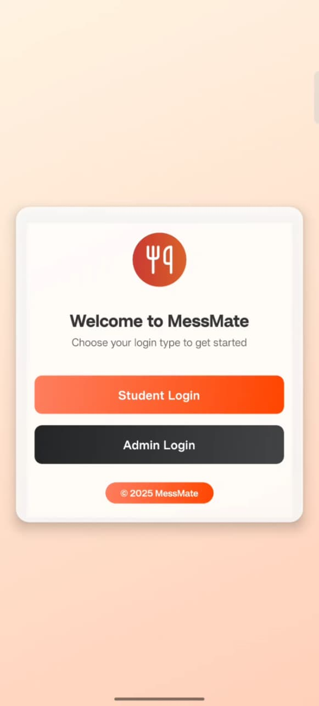
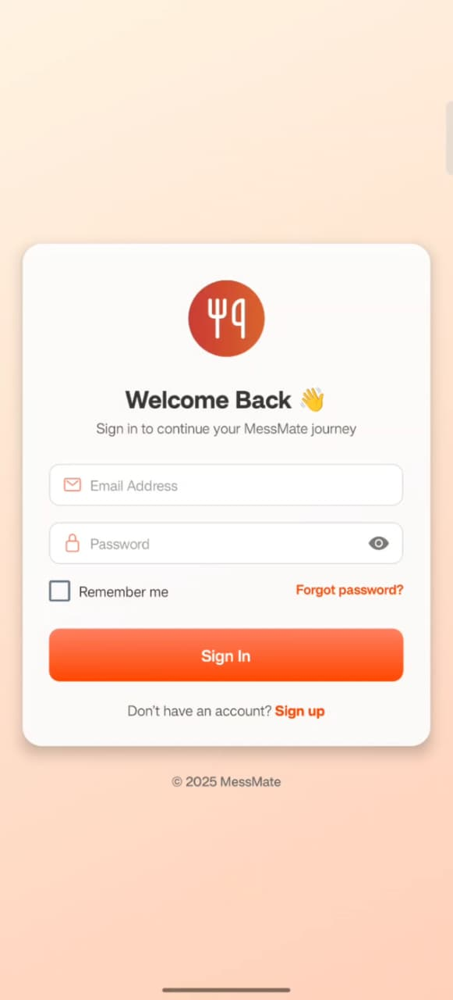
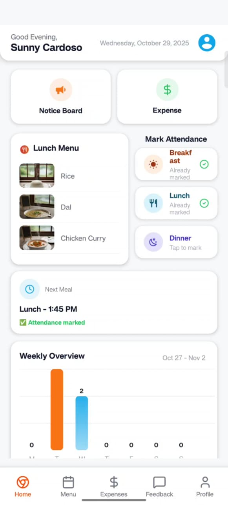
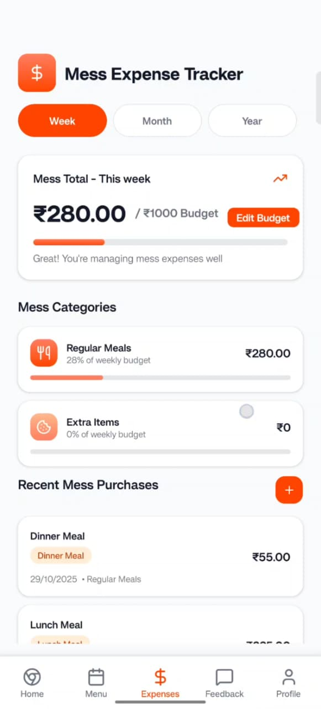
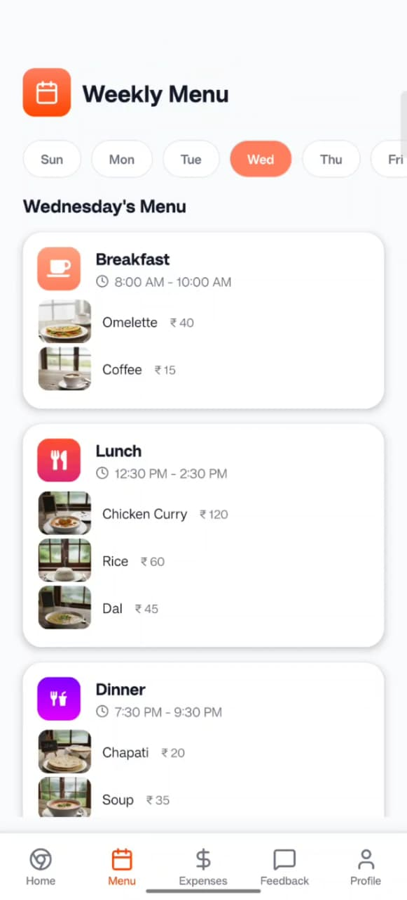
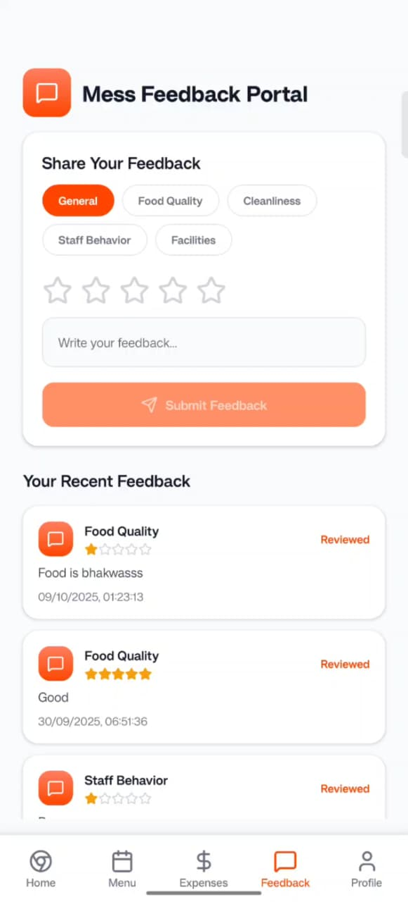
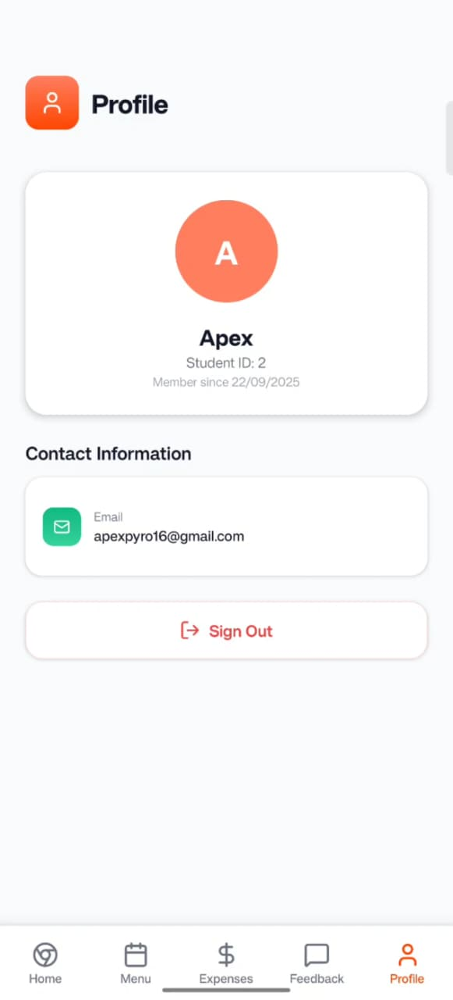
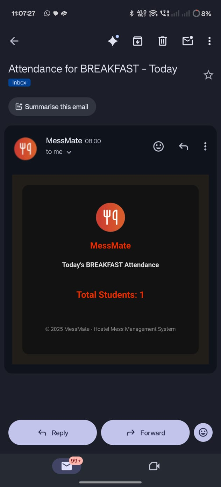
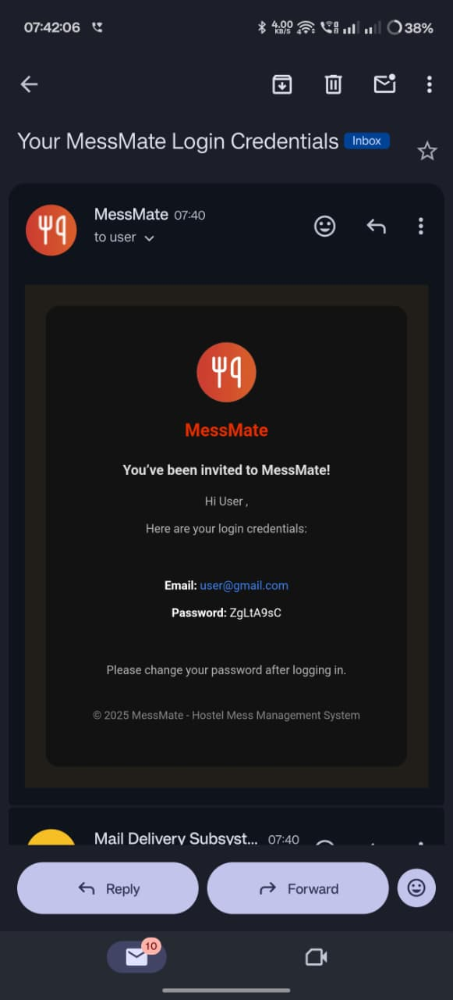

# 🍽️ MessMate – Hostel Mess Management System

> **MessMate** is a mobile application designed to simplify hostel mess operations by digitizing attendance, menu management, billing, and feedback.  
> It serves as a bridge between **students** and **mess administrators**, ensuring a transparent and efficient mess management experience.

---

➡️ **MessMate** provides a **digital, centralized platform** to address all these challenges efficiently.

---

## 🏗️ Project Description

**MessMate** is a full-stack, cross-platform application developed using:
- **Frontend:** React Native  
- **Backend:** Node.js with Express.js  
- **Database:** MySQL  

The system connects both **students** and **mess administrators** through a single platform.

### 👨‍🎓 Student Portal
- View daily or weekly **meal menus**
- **Mark attendance** for each meal (breakfast, lunch, dinner)
- Check **weekly/monthly/yearly mess bills**
- Submit **complaints or feedback** directly to the mess administration

### 🧑‍💼 Admin Portal
- Manage **student records** and **meal attendance**
- Update or modify **daily menus**
- Monitor **meal participation **
- View and respond to **feedback or complaints**

---

## 🧰 Tech Stack

---
# 📱 Application UI Screenshots

<table>
  <tr>
    <td align="center">
       
      <b>Choose Role UI</b>
    </td>
    <td align="center">
       
      <b>Login UI</b>
    </td>
  </tr>
</table>

 

<table>
  <tr>
    <td align="center">
       
      <b>Dashboard UI</b>
    </td>
    <td align="center">
       
      <b>Expense UI</b>
    </td>
    <td align="center">
       
      <b>Menu UI</b>
    </td>
  </tr>

  <tr>
    <td align="center">
       
      <b>Feedback UI</b>
    </td>
    <td align="center">
       
      <b>Profile UI</b>
    </td>
    <td align="center">
       
      <b>Meal Attendance UI</b>
    </td>
  </tr>
</table>

 

<table>
  <tr>
    <td align="center">
       
      <b>Email Invite System</b>
    </td>
  </tr>
</table>

---
